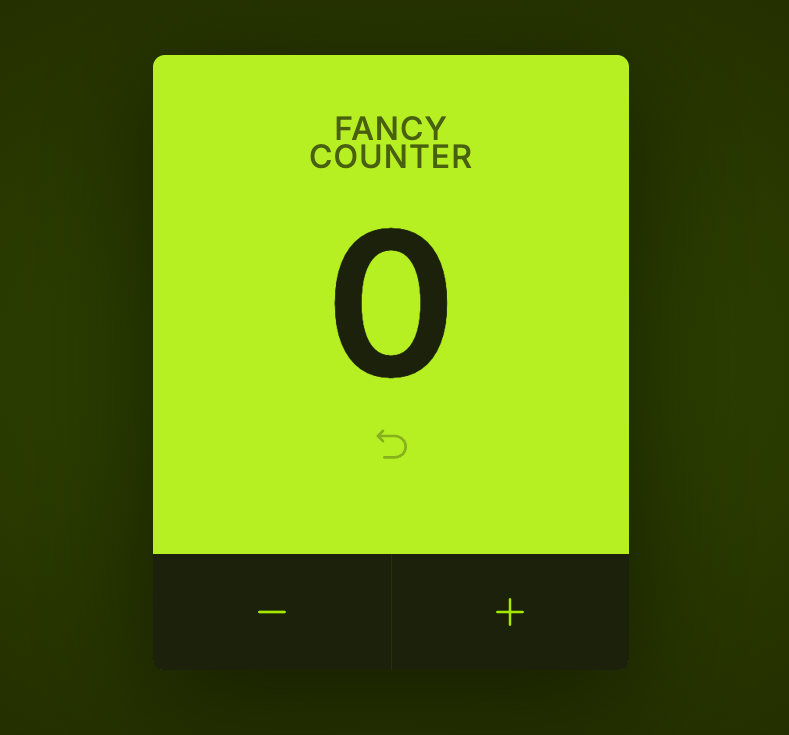

# Fancy Counter

Fancy Counter is a React application built with Vite to practice and understand key concepts of React development.

## Features

- **Basic Functionality:** The counter can increment by 1, decrement by 1, and reset to 0.
- **Limits and Prompts:** The count cannot go below 0. When the count reaches 5, users are prompted to "buy" a theoretical "Pro" version to continue counting. Buttons are disabled upon reaching these limits.
- **Responsive Design:** The app adjusts its styling based on the viewport for a responsive user experience.
- **Keyboard Interaction:** The spacebar can be used to increment the counter, showcasing the useEffect hook.
- **Component-Based Architecture:** The project demonstrates the creation and reuse of React components for a clear and manageable component tree.
- **State and Props Management:** This project highlights managing state with the useState hook, passing props, children composition, and destructuring.

## Screenshots

- _Initial state of the counter._

- _Counter at its limit, prompting for the "Pro" version._

## Learning Outcomes

This project helped in understanding:

- Using the useState and useEffect hooks.
- Creating reusable components and managing a component hierarchy.
- Handling props and state efficiently.
- Applying responsive design principles in a React application.

This project was developed using the **Professional React & Next.js** tutorials on _bytegrad.com_.
